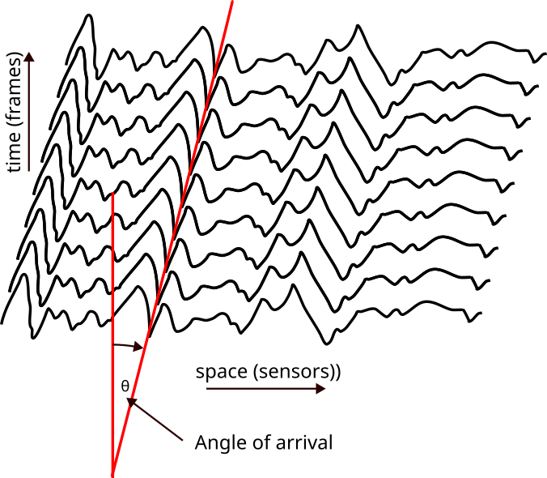
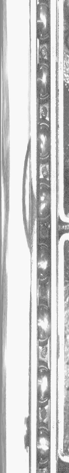
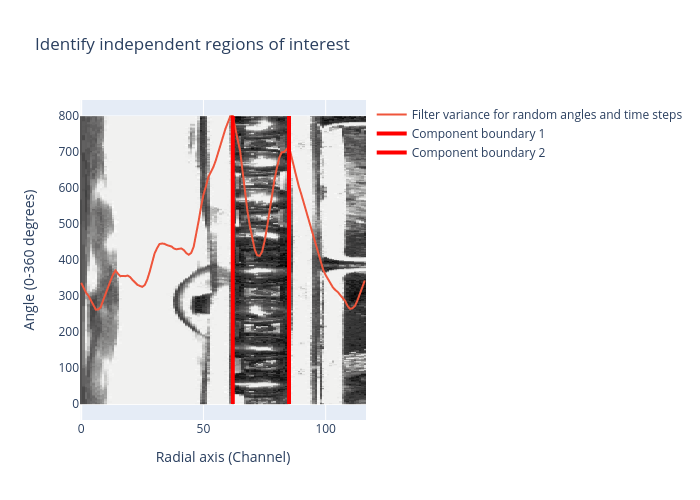
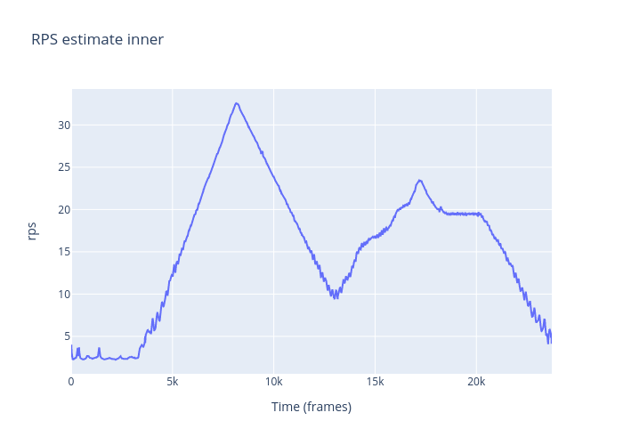

# Bearing Fault Diagnosis from Video

This project diagnoses bearing faults in rotating machinery using video analysis. It processes video frames to extract rotational speeds and detect fault frequencies via spectral analysis.

Dataset: https://zenodo.org/records/13707571

## Pipeline

1. Remove faulty frames with `fill_in_faulty_frames.py`
2. Convert to polar coordinates and reduce dimensions with `transform_and_reduce.py`
   
3. Identify independent components (inner race, cage, outer race) with `identify_independent_regions_of_interest.py`
   
4. Reduce each component to a single signal with `reduce_component_to_signal.py`
5. Estimate speeds using beamforming with `speed_estimation_on_reduced_signal.py`
   
6. Diagnose faults from speed profiles with `fault_estimation_from_speed.py`

## Dependencies

- numpy, scipy, opencv-python, plotly, scikit-learn, matplotlib, joblib, tqdm

